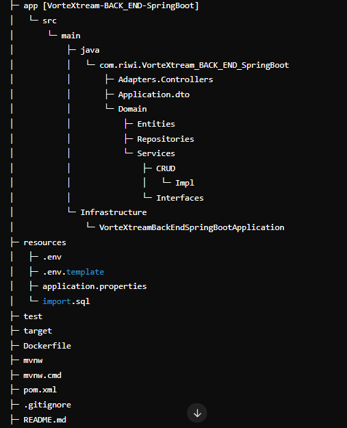

# Vortextream

VorteXtream is a streaming platform that allows users to watch series, movies of all genres and live broadcasts. Its purpose is to offer entertainment to a global audience, providing both on-demand content and live events. The platform is ideal for people who enjoy a wide variety of audiovisual content and are looking for an interactive experience, being able to not only consume, but also create and broadcast their own events in real time.


## Table of Contents
1. [Description](#description)
2. [Installation](#installation)
3. [Authors](#authors)


## Description
People have to have many accounts in different apps, to be able to have the most multimedia content, this being a tedious job, sometimes there is even content that does not reach the platforms, we come to solve that with VorteXtream.

> This project is a RESTful API built with Spring Boot that allows managing a to-do list. It includes CRUD operations and JWT authentication.
> 
>The architecture used in the "VorteXtream" project was hexagonal and was structured like this:
> 
> 
> 

## Installation
If you need to run a website on your machine, you need to clone it using the following path. 

### Prerequisites
List the tools the user needs to have installed before using the project:
- Java 17
- Maven 4.0.0

### Project Setup
1. Clone the repository:
    ```bash
    git clone https://github.com/Jerocruz76/VorteXtreamBackendSpringBoot.git
    cd your-java-project
    ```

2. Configure the environment variables:
    - Create a `.env` file or edit `application.properties` with your database credentials:
      ```properties
      spring.datasource.url=jdbc:mysql://mysql-ab2d1a7-jerocruz76-0502.d.aivencloud.com:24773/vorteXtream
      spring.datasource.username=${DB_USERNAME}
      spring.datasource.password=${DB_PASSWORD}

      ```

3. Run the project with Maven:
    ```bash
    mvn spring-boot:run
    ```

## Authors
Made by:
 - Jerónimo Cruz Arango
 - Nicolas Aguirre Florez
 - Nicolas Bernal Morales